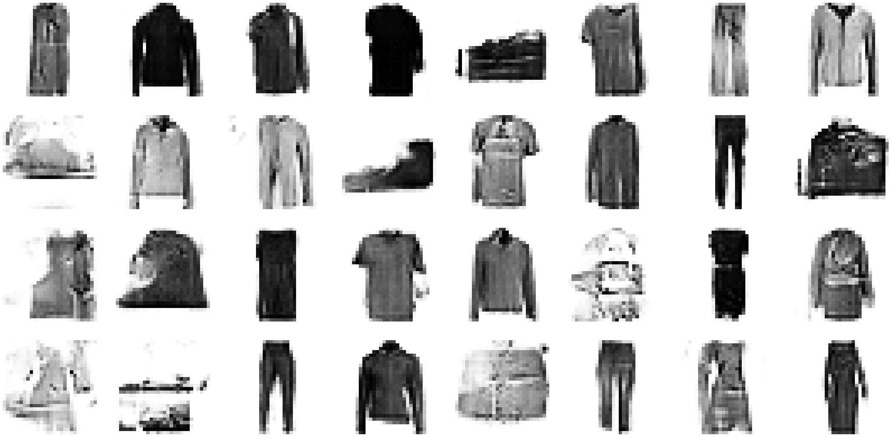

# DCGANs
An attempt to understand and practice Deep Convolutional Generative Adversarial Networks.

Used Fashion MNIST datast to generate images of different fashion items from noise vectors.

Noise:

Generated Images:

